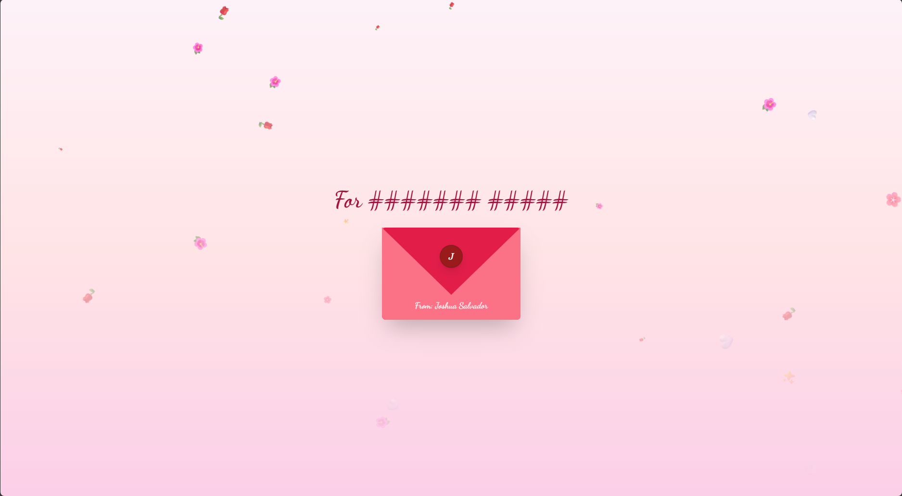

# 💌 Valentine's Confession Web Experience

An interactive, mobile-first web experience designed for a heartfelt Valentine's Day confession. This project features high-end animations, interactive components, and a personalized narrative flow.

 

## ✨ Features

- **Interactive Envelope:** A 3D-styled envelope that opens with a tap to reveal the personal message.
- **Typewriter Poem:** Heartfelt words that reveal themselves one by one for a dramatic, storytelling effect.
- **Infinite Swipe Cards:** A looping stack of "Reasons Why" cards that Frances can swipe through infinitely.
- **Scratch-to-Reveal:** An interactive scratch card that hides a secret message until rubbed.
- **The "Unclickable" No Button:** A playful "No" button that repels the cursor and teleports to random locations if cornered, ensuring the answer is always "Yes."
- **Immersive Atmosphere:** Automated falling flower petals and sparkles, paired with a breathing photo animation.
- **3D Tilt Effect:** The main photo reacts to mouse movement on desktop and device orientation (gyroscope) on mobile.
- **Messenger Integration:** A success screen featuring a stylized "Date Ticket" with a direct link to send a confirmation via Facebook Messenger.

## 🛠️ Tech Stack

- **HTML5 / CSS3** (Custom 3D transforms & animations)
- **Tailwind CSS** (Utility-first styling)
- **GSAP (GreenSock Animation Platform)** (High-performance UI animations)
- **Canvas API** (For the interactive scratch card)
- **Confetti.js** (Celebration effects)

## 📂 Project Structure

```text
├── index.html          # Main entry point
└── assets/
    ├── style.css       # Custom animations and styling
    ├── script.js       # Game logic, repellent button, and card swiping
    └── music.mp3
    └── photo.jpg
